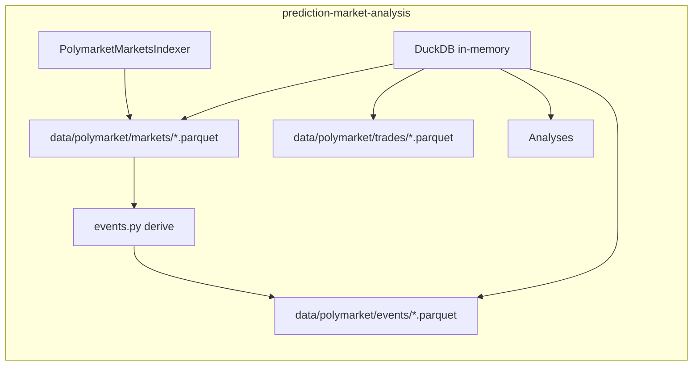

# Implementation Guide: Store Events in Database and Integrate with DuckDB

## 1. Overview

**Goals**

- Store pipeline events (from collect-events-v2 and related flows) in a persistent store.
- Integrate that store with existing DuckDB usage in prediction-market-analysis so analyses can query and join events with markets/trades Parquet.

**Current state**

- **OpenClaw:** `collect-events-v2.mjs` outputs events as JSON (e.g. redirected to `events.json`). It optionally writes into SQLite `events` in polymarket_trade_sport/db.
- **prediction-market-analysis:** DuckDB is used in-memory only; data lives in Parquet under `data/polymarket/markets/` and `data/polymarket/trades/`. Analyses query via paths like `FROM '{self.markets_dir}/*.parquet'`.

**Recommended architecture**

- **Storage:** Parquet in prediction-market-analysis at `data/polymarket/events/`. No separate event DB; DuckDB reads events from Parquet like markets/trades.
- **Data collection:** Events are derived from already-collected markets data (no new API calls) by reading `data/polymarket/markets/*.parquet`, applying filters, and writing to `data/polymarket/events/`. Optionally, a direct scan using `PolymarketClient.iter_markets()` can be used for a fresh snapshot.



---

## 2. Canonical Event Schema

Use one schema for Parquet (and optionally SQLite) so the same records can be consumed consistently.

| Column         | Type    | Notes                                   |
|----------------|---------|----------------------------------------|
| scan_id        | TEXT    | e.g. `pma-{timestamp}`                 |
| event_id       | TEXT    | Polymarket market/event id              |
| strategy       | TEXT    | e.g. `polymarket-trade-news`            |
| title          | TEXT    | question/title                         |
| slug           | TEXT    | market slug                             |
| category       | TEXT    | crypto, politics, finance, sports, tech, other |
| market_price   | DOUBLE  | Yes outcome price                       |
| outcome_prices | TEXT    | JSON e.g. `[0.65, 0.35]`               |
| liquidity      | DOUBLE  | USD                                     |
| volume         | DOUBLE  | USD                                     |
| end_date       | TEXT    | ISO or Unix                             |
| raw_data       | TEXT    | JSON full normalized payload            |
| scanned_at     | INTEGER | Unix ms                                 |

For Parquet: use string, double, int64 (scanned_at). Keep `outcome_prices` and `raw_data` as string (JSON).

---

## 3. Storage (Option A only)

- **Path:** `data/polymarket/events/` inside prediction-market-analysis.
- **Naming:** One file per scan, e.g. `events_{scan_id}.parquet` with `scan_id` sanitized (e.g. `pma-1730123456789`).
- **Dedup:** When querying, use `ROW_NUMBER() OVER (PARTITION BY event_id ORDER BY scanned_at DESC)` to get latest per event.

---

## 4. Writing Events

**Primary — derive from markets Parquet**

- Data is already collected by `PolymarketMarketsIndexer`; no new API calls.
- Run `src.indexers.polymarket.events` (or `main.py index` and select the events indexer): it reads `data/polymarket/markets/*.parquet`, applies event filters (see filter parity below), classifies category from `question`, maps to the canonical event schema, assigns `scan_id` and `scanned_at`, writes to `data/polymarket/events/events_{scan_id}.parquet`.
- **Run order:** Run the markets indexer first, then the events derivation.

**Optional — direct event scan**

- Same module can call `PolymarketClient.iter_markets()`, apply the same filters in memory, and write events Parquet. Use when a fresh snapshot is needed without a full backfill.

**Filter parity (collect-events-v2 vs Python)**

| Filter              | Python (events from markets)                             |
|---------------------|----------------------------------------------------------|
| active / closed     | `active == True and closed == False`                     |
| end_date            | `end_date` not null; `end_date > now`                   |
| min_hours_until_end | `(end_date - now).total_seconds() >= min_hours * 3600`   |
| max_days_until_end  | `(end_date - now).days <= max_days`                      |
| min_liquidity_usd   | `liquidity >= min_liquidity_usd`                         |

**Category classification:** Port keywords from collect-events-v2 (crypto, politics, finance, sports, tech, entertainment) and set `category` from `question` (and optional `description` if present).

---

## 5. Reading Events in DuckDB

**Parquet**

- Set `events_dir = Path("data/polymarket/events")` (or from config).
- Query: `con.execute("SELECT * FROM read_parquet(?)", [str(events_dir / "*.parquet")])` or `FROM '{events_dir}/*.parquet'`.
- Latest scan per event: `ROW_NUMBER() OVER (PARTITION BY event_id ORDER BY scanned_at DESC)` then filter `rn = 1`.

**Joins with existing data**

- Join events to markets: `events.event_id = markets.id`.
- Join to trades: via markets (e.g. condition_id / clob_token_ids). Example: events joined to markets joined to trades aggregated for “events that have high volume in trades”.

**Example SQL (latest event per market, then join to markets)**

```sql
WITH latest_events AS (
  SELECT *, ROW_NUMBER() OVER (PARTITION BY event_id ORDER BY scanned_at DESC) AS rn
  FROM read_parquet('data/polymarket/events/*.parquet')
)
SELECT e.event_id, e.title, e.category, e.market_price, e.liquidity, m.volume, m.condition_id
FROM latest_events e
JOIN read_parquet('data/polymarket/markets/*.parquet') m ON e.event_id = m.id
WHERE e.rn = 1;
```

---

## 6. Concrete Steps (Checklist)

1. Define Parquet directory and naming: `data/polymarket/events/`, `events_{scan_id}.parquet`.
2. Implement derivation in `src/indexers/polymarket/events.py`: read markets Parquet, apply filter-parity logic, map to event schema, write events Parquet. Reuse existing markets indexer as single source of truth.
3. Optional: add direct-scan path using `PolymarketClient.iter_markets()` in the same module.
4. Add one example analysis that queries events Parquet and joins to markets/trades: [polymarket_events_and_markets.py](../src/analysis/polymarket/polymarket_events_and_markets.py).
5. Document run order: markets indexer then events derivation.

---

## 7. Cross-References

- [event-database-handle-trading.md](.openclaw/workspace/.todo/event-database-handle-trading.md) — discussion and direction for local event storage.
- [filter-inventory-and-relaxation.md](.openclaw/workspace/.todo/filter-inventory-and-relaxation.md) — pipeline filter inventory and relaxation.
- [ANALYSIS.md](ANALYSIS.md) — prediction-market-analysis analysis framework.
- [PolymarketMarketsIndexer](../src/indexers/polymarket/markets.py) — single source of truth for markets data.
